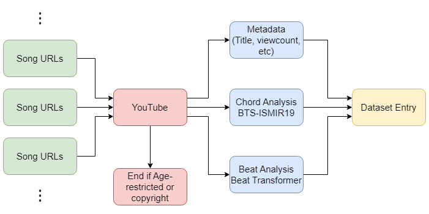
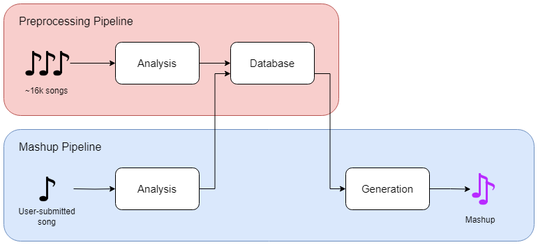
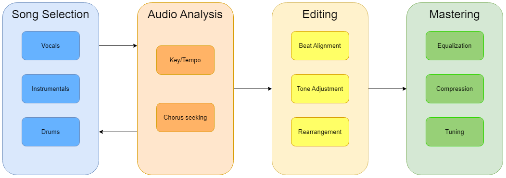

</img>

# What is Auto Masher?
Auto Masher is a research project that aims to create pop song mashups with AI-assisted music information retrieval and analysis. In this project, we have compiled a dataset of pop songs and their corresponding chords and beats. The user will submit a song from YouTube, and the pipeline will automatically find the best song to mashup with the user's song.

Our technical paper "Retrieval-based automatic mashup generation with deep learning-guided features" has been accepted by the 25th International Congress on Acoustics/188th Meeting of the Acoustical
Society of America (ICA2025 New Orleans)

Auto Masher has been awarded the second-runner up in Best Final Year Project Award in the Department of Computer Science, HKUST in the year 2023-2024.

# Installation

## Requirements
- Python 3.12 (should theoretically work with Python 3.10+. Tested only on Python 3.12)
- A decent GPU with some VRAM (>= 4GB) if possible
- C++14 compatible compiler (for `madmom` library)
- `ffmpeg` installed on your system and added to your PATH

## Installation
1. Clone the repository
```bash
git clone https://github.com/darinchau/AutoMasher
```

2. Create a virtual environment
```bash
cd AutoMasher
python3.12 -m venv .venv
sudo chmod 777 .venv/bin/activate
source .venv/bin/activate
```

3. Install the required packages
```bash
pip install -r requirements.txt
```

4. Run the Gradio web demo
```bash
gradio demo.py
```
If prompted, install `madmom` by running the following commands
```bash
pip install git+https://github.com/darinchau/madmom
```
(The `madmom` library is a forked version of the original library to ensure consistency)

`main.py` provides a little code example of how to use the pipeline.

## Installation (Extra)

1. If you want to load the dataset quicker you can run a script to partially unzip the dataset
```bash
python -m scripts.make_fast_db
```
depending on your system, this will take a few minutes to complete, and will save you about 3x-5x the time when loading the dataset.

## Inner Workings
We have collected about 19000 songs from YouTube and processed them to extract the chords and beats. We estimate the chords of the song using [BTC-ISMIR19](https://github.com/jayg996/BTC-ISMIR19) (Park and Choi, 2019) and beats using a slightly modified version of [Beat-Transformer](https://github.com/zhaojw1998/Beat-Transformer) (Zhao, Xia, and Wang, 2022). We also used [Demucs](https://github.com/facebookresearch/demucs) (Defossez, 2020) to separate the tracks of a song.

Refer to our report (under `resources/report.pdf`) for more details.

### The data collection pipeline

</img>

### The query pipeline

</img>

### The mashup pipeline


# Contributions
Contributions are welcome! Please raise an issue or a pull request if you have any suggestions or improvements.

# Special Thanks
- Prof. Andrew Horner, our wonderful supervisor for his guidance
- Joshua Chang, Harris Lau, Anthony Chan, our amazing teammates for their hard work
- The developers of the libraries we used
- Everyone else who helped us along the way
